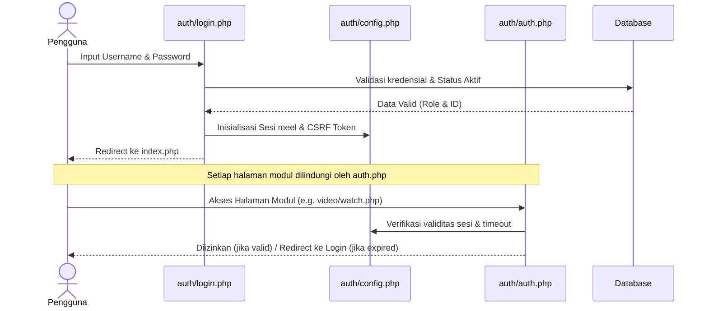
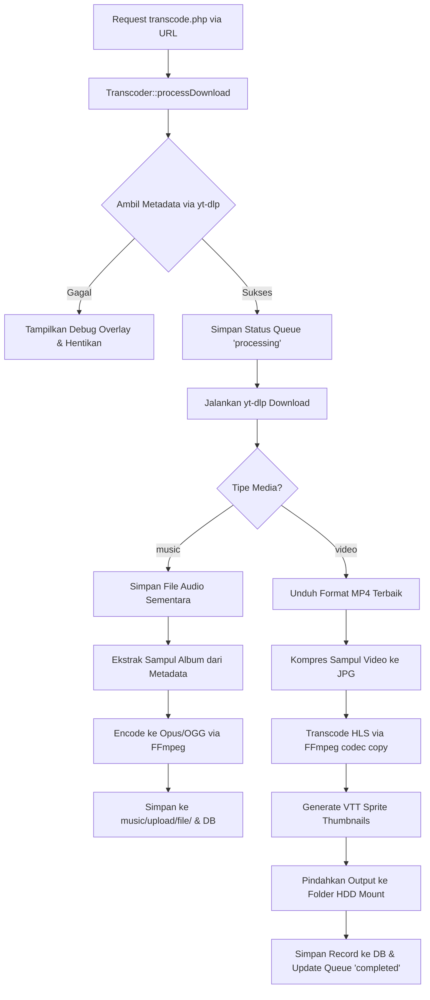

# MEeL — Media Hub Platform

<div align="center">
  
</div>

**Platform media cloud terpadu untuk streaming video, musik, membaca buku digital, dan penyimpanan file pribadi.**

[](https://www.php.net/)
[](https://www.mysql.com/)
[](https://tailwindcss.com/)
[](LICENSE)

---

MEeL adalah platform media hub pribadi berbasis PHP & MySQL yang berjalan di atas Apache (XAMPP/LAMPP). Platform ini menggabungkan modul **Video**, **Music**, **Books**, dan **Cloud Drive** ke dalam antarmuka web gelap bertema monospace yang modern. Sistem ini dilengkapi dengan streaming HLS (HTTP Live Streaming), transcoding otomatis menggunakan FFmpeg, integrasi yt-dlp untuk download via URL, serta manajemen file berbasis peran (_role-based access control_).

## Daftar Isi

- [Fitur Utama](#fitur-utama)
- [Tech Stack](#tech-stack)
- [Struktur Proyek](#struktur-proyek)
- [Persyaratan Sistem](#persyaratan-sistem)
- [Instalasi](#instalasi)
- [Konfigurasi](#konfigurasi)
- [Penggunaan](#penggunaan)
- [Arsitektur Aplikasi & Flow Diagram](#arsitektur-aplikasi--flow-diagram)
- [Detail Modul & Arsitektur Direktori](#detail-modul--arsitektur-direktori)
- [Helper Utilities](#helper-utilities)
- [Activity Logger](#activity-logger)
- [Keamanan & Permissions](#keamanan--permissions)
- [Cookies & yt-dlp Authentication](#cookies--yt-dlp-authentication)
- [Troubleshooting](#troubleshooting)
- [Rekomendasi OS](#rekomendasi-os)
- [Kontribusi](#kontribusi)
- [Lisensi](#lisensi)

---

## Fitur Utama

### 🎬 Video (Streaming HLS)

- Streaming adaptif menggunakan HLS (`.m3u8` playlist dan segment `.ts`) dengan fallback MP4 otomatis.
- Player video kustom berbasis Plyr.js dengan quality selector, subtitle/caption switching, Picture-in-Picture (PiP), dan pintasan keyboard (_keyboard shortcuts_).
- **Gesture Sentuh Mobile**: double-tap area kiri (rewind 5 detik), double-tap area kanan (forward 5 detik), dan single-tap area tengah (play/pause).
- **Seamless Video Transition**: transisi video berikutnya secara dinamis (SPA-like) tanpa reload halaman, mempertahankan status layar penuh (_fullscreen_), serta merefresh _VTT sprite preview thumbnails_ agar sinkron dengan video baru.
- Resume otomatis posisi pemutaran terakhir menggunakan `localStorage`.

### 🎵 Music (Audio Platform)

- Streaming audio berkualitas tinggi (MP3, FLAC, OGG/Opus).
- Pembuatan dan manajemen playlist kustom.
- Pengaturan antrean lagu dinamis.
- Filter pencarian cepat berdasarkan format file dan nama artis.

### 📚 Books (Digital Library)

- Pembaca buku digital (E-Book/PDF) terintegrasi langsung di browser.
- Panel unggah buku dengan pembuatan sampul (_cover_) otomatis dan manajemen metadata buku.

### ☁️ Cloud Drive (Personal Cloud Storage)

- Penyimpanan file terbagi menjadi direktori **Public** (akses umum) dan **Private** (akses personal per pengguna).
- Pembatasan kapasitas unggah file berdasarkan kuota pengguna.
- Manajemen file (unggah, unduh, hapus) yang disesuaikan dengan peran pengguna (`admin` / `member`).

### 🔧 Fungsionalitas Umum

- Portal dashboard utama dengan statistik kapasitas disk dan ringkasan jumlah media.
- Fitur **Transcoding & Download URL** terintegrasi menggunakan `yt-dlp` dan `FFmpeg`.
- Kolom komentar bertingkat (nested comments) serta fitur Like/Dislike pada Video dan Musik.
- Panel edit profil untuk memperbarui nama pengguna, kata sandi, dan foto avatar.
- Keamanan sesi yang diperketat (Timeout 12 jam, proteksi CSRF Token, dan pemutusan sesi ganda).
- Sistem firewall internal: pelacakan aktivitas (_activity logging_) dan pemblokiran IP (_IP banning_).
- **Mode Sehat 20-20-20**: notifikasi berkala untuk mengistirahatkan mata setiap 20 menit.
- Halaman panduan interaktif (`introduction.php`) dan riwayat pembaruan aplikasi (`update.php`).

---

## Tech Stack

| Layer              | Teknologi                       | Keterangan                                    |
| ------------------ | ------------------------------- | --------------------------------------------- |
| **Backend**        | PHP 8.0+                        | Core logic & API endpoints                    |
| **Database**       | MySQL 5.7+ / MariaDB            | Relational storage & metadata                 |
| **Web Server**     | Apache 2.4+                     | Menggunakan rewrite engine (`mod_rewrite`)    |
| **Styling**        | TailwindCSS (CDN) & Vanilla CSS | UI/UX bergaya dark-mode & monospace           |
| **Interaktivitas** | HTMX & Vanilla JavaScript       | AJAX tanpa reload halaman (SPA-like)          |
| **Media Player**   | Plyr.js & HLS.js                | Engine pemutaran video HLS & audio            |
| **Transcoding**    | FFmpeg & FFprobe                | Segmentasi HLS, kompresi, & ekstrak thumbnail |
| **Downloader**     | yt-dlp                          | Pengunduhan media dari URL eksternal          |
| **Transliterasi**  | PHP `intl` (Transliterator)     | Pembersihan nama file (Romaji conversion)     |

---

## Struktur Proyek

Berikut adalah peta struktur berkas dan direktori lengkap di dalam proyek MEeL:

```
MEeL/
├── admin/                 # Panel Admin (Akses khusus role admin)
│   ├── .htaccess          # Proteksi direktori admin
|   ├── header-admin.php   # Header admin (digunakan di semua halaman admin)
│   ├── cookies.php        # Halaman Media Analytics & Monitor
│   ├── edit-music.php     # Form edit metadata musik
│   ├── edit-video.php     # Form edit metadata video
│   └── index.php          # Dashboard System Admin
├── anime/                 # Modul Anime (Dalam pengembangan)
│   ├── index.php          # Halaman daftar anime
│   ├── watch.php          # Halaman nonton anime
│   └── sidebar.php        # Navigasi sidebar anime
├── assets/                # Aset Statis
│   ├── css/               # Stylesheet khusus per modul
│   │   ├── styles.css     # CSS HUB
│   │   ├── plyr.css       # CSS Plyr custom
│   │   ├── video.css      # CSS Video(index/watch)
│   │   ├── em.css         # CSS edit di Admin
│   │   ├── music.css      # CSS Music(index/watch)
│   │   ├── drive.css      # CSS Drive
│   │   ├── up.css         # CSS partials/ui.php
│   │   └── font.css       # Font google API
│   ├── js/                # Library dan skrip JS utama
│   │   ├── tailwind.js    # Tailwind
│   │   ├── plyr.js        # PLYR
│   │   ├── hls.js         # HLS
│   │   ├── htmx.js        # HTMX/SPA
│   │   ├── lucide.js      # Lucide Icon
│   │   ├── sweetalert2.all.min.js # SweetAlert
│   │   ├── player_video.js   # Logic gesture mobile & refresh VTT sprite
│   │   ├── player_music.js   # Logic Visualition % mini-player
│   │   └── script.js      # Health reminder & Alert custom
│   ├── img/               # Pendukung Introduction
│   │   ├── music0.png
│   │   ├── music1.png
│   │   ├── video0.png
│   │   └── video1.png
│   └── MEeL.png           # Logo Utama
├── auth/                  # Autentikasi & Manajemen Sesi
│   ├── .htaccess          # Proteksi direktori auth
│   ├── auth.php           # Middleware Guard Login & Validasi Role
│   ├── config.example.php # Contoh konfigurasi DB & System
│   ├── config.php         # Konfigurasi aktif DB, Session, CSRF, Helper Transliterasi
│   ├── login.php          # Form login user
│   ├── logout.php         # Handler logout & hancurkan sesi
│   └── register.php       # Form registrasi user baru
├── books/                 # Modul E-Book / Komik
│   ├── index.php          # Katalog buku digital
│   ├── read.php           # Reader PDF/Epub di browser
│   └── upload.php         # Form upload buku baru
├── controllers/           # API Actions & Event Handler (AJAX/HTMX)
│   ├── delete_comment.php # Hapus komentar video/musik
│   ├── fun.php            # Fungsi utilitas pemantauan kapasitas & analytics admin
│   ├── like.php           # Toggle like/dislike media
│   ├── post_encode.php    # Trigger encoding musik setelah download yt-dlp
│   ├── profile_edit.php   # Edit profil (avatar, username, password)
│   ├── proses_sidebar.php # Update status sidebar state
│   └── proses_update.php  # Simpan logs update aplikasi
├── data_drive/            # Cloud Drive Storage (Direktori Runtime)
│   ├── public/            # File drive yang bisa diakses siapa saja
│   └── private_admins/    # File drive pribadi khusus admin
├── drive/                 # Modul Cloud Drive
│   ├── DriveService.php   # Class service & context untuk Drive
│   ├── index.php          # Tampilan utama cloud drive
│   ├── upload.php         # Handler upload file drive
│   ├── download.php       # Handler download file drive
│   └── delete.php         # Handler hapus file drive
├── err/                   # Halaman Kesalahan / Error Handling
│   ├── denied.php         # Tampilan akses ditolak
│   └── maintance.php      # Tampilan maintenance (ketika media offline)
├── modules/               # Core Logic & Business Layer
│   ├── MediaInteraction.php # Model untuk handling like/dislike & komentar
│   ├── MediaLibrary.php     # Model untuk katalog video, musik, buku
│   ├── MediaViewer.php      # Model untuk view tracking & rekomendasi media
│   ├── System.php           # Kontrol queue status, server busy, & active tasks
│   ├── Transcoder.php       # Engine transcode HLS & download yt-dlp
│   ├── Uploader.php         # Handler upload lokal & FFmpeg trigger
│   ├── activity_logger.php  # System Activity Logging & IP Ban Firewall
│   └── helpers.php          # Helper format byte, selisih waktu, & HDD status
├── music/                 # Modul Pemutar Musik
│   ├── index.php          # Katalog musik
│   ├── watch.php          # Player musik utama (Plyr)
│   ├── upload.php         # Form upload lagu lokal
│   ├── search_music.php   # Handler pencarian lagu
│   ├── load_more_music.php# Pagination AJAX untuk musik
│   ├── music_item.php     # Komponen UI kartu lagu
│   ├── playlist_action.php# Tambah/hapus lagu dari playlist
│   └── view_playlist.php  # Halaman detail playlist musik
├── partials/              # Reusable UI Components
│   ├── .htaccess          # Proteksi direktori partials
│   ├── footer.php         # Footer global
│   ├── link.php           # Stylesheet & Script imports
│   ├── nav.php            # Sidebar navigation (responsif)
│   ├── navbar.php         # Header navbar
│   └── ui.php             # Template UI Overlay Transcoding
├── profile/               # Modul Profil User
│   ├── index.php          # Halaman profil user
│   └── upload/            # Uploaded avatars
├── temp/                  # Direktori Runtime: Staging Transcoding & Download
├── upload/                # Direktori Runtime: Upload file sementara
├── video/                 # Modul Pemutar Video
│   ├── index.php          # Katalog video
│   ├── watch.php          # Player video utama (HLS / Plyr)
│   ├── upload.php         # Form upload video lokal
│   ├── search_video.php   # Handler pencarian video
│   ├── load_more.php      # Pagination AJAX untuk video
│   └── video_card.php     # Komponen UI kartu video
├── .gitignore             # Git ignore patterns
├── .htaccess              # Apache URL rewrite engine
├── LICENSE                # File Lisensi Proyek
├── README.md              # Dokumentasi proyek (file ini)
├── cookies.txt            # Catatan cookie yang digunakan oleh yt-dlp untuk autentikasi
├── index.html             # Landing page statis (fallback)
├── index.php              # Homepage Hub / portal modul
├── introduction.php       # Panduan interaktif walkthrough
├── transcode.php          # Entry point URL download & transcode (yt-dlp → FFmpeg)
├── update.php             # Halaman log changelog & update
└── upload_advanced.php    # Form upload & transcode lanjutan untuk Admin
```

---

## Persyaratan Sistem

### Minimum Requirements

| Komponen    | Versi                | Keterangan                                                |
| ----------- | -------------------- | --------------------------------------------------------- |
| **PHP**     | 8.0+                 | Versi 8.0+ sangat disarankan                              |
| **MySQL**   | 5.7+ / MariaDB 10.2+ | Skema mendukung encoding `utf8mb4`                        |
| **Apache**  | 2.4+                 | Wajib mengaktifkan modul `mod_rewrite`                    |
| **FFmpeg**  | 6.0+                 | Dibutuhkan untuk pembuatan segmen HLS dan kompresi media  |
| **yt-dlp**  | Versi Terbaru        | Dibutuhkan untuk fungsionalitas unduhan media via URL     |
| **RAM**     | 2 GB+                | Direkomendasikan 4 GB+ agar transcoding background lancar |
| **Storage** | 10 GB+               | Tergantung ukuran penyimpanan media yang di-mount         |

### PHP Extensions

Pastikan modul-modul PHP berikut diaktifkan pada server Anda:

```ini
extension=mysqli
extension=pdo_mysql
extension=gd
extension=fileinfo
extension=json
extension=mbstring
extension=intl
```

> **Penting**: Ekstensi `intl` (Internationalization) wajib aktif untuk proses pembersihan nama file (transliterasi karakter khusus Jepang/Kana ke Romaji) menggunakan class `Transliterator`.

---

## Instalasi

### 1. Kloning Repositori

Masuk ke direktori web root server Apache Anda, kemudian jalankan kloning:

```bash
cd /opt/lampp/htdocs
git clone https://github.com/mifada2543/MEeL.git MEeL
```

### 2. Konfigurasi Database

Buat database baru di MySQL:
Import code SQL yang disediakan dalam proyek ke database `MEeL`.
template:

```sql
-- Membuat database jika belum ada
CREATE DATABASE IF NOT EXISTS `MEeL` DEFAULT CHARACTER SET utf8mb4 COLLATE utf8mb4_general_ci;
USE `MEeL`;

-- --------------------------------------------------------

SET SQL_MODE = "NO_AUTO_VALUE_ON_ZERO";
START TRANSACTION;
SET time_zone = "+00:00";

/*!40101 SET @OLD_CHARACTER_SET_CLIENT=@@CHARACTER_SET_CLIENT */;
/*!40101 SET @OLD_CHARACTER_SET_RESULTS=@@CHARACTER_SET_RESULTS */;
/*!40101 SET @OLD_COLLATION_CONNECTION=@@COLLATION_CONNECTION */;
/*!40101 SET NAMES utf8mb4 */;

--
-- Struktur dari tabel `users`
--

CREATE TABLE IF NOT EXISTS `users` (
  `id` int(11) NOT NULL AUTO_INCREMENT,
  `username` varchar(50) NOT NULL,
  `role` enum('admin','user') NOT NULL DEFAULT 'user',
  `ip_address` varchar(45) DEFAULT NULL,
  `password` varchar(255) NOT NULL,
  `created_at` timestamp NOT NULL DEFAULT current_timestamp(),
  `last_activity` timestamp NOT NULL DEFAULT current_timestamp() ON UPDATE current_timestamp(),
  `last_page` varchar(255) DEFAULT NULL,
  `user_agent` varchar(255) DEFAULT NULL,
  `is_active` tinyint(1) DEFAULT 1,
  `bio` text DEFAULT NULL,
  `profile_picture` varchar(255) DEFAULT 'default_avatar.png',
  `favorite_genre` varchar(100) DEFAULT NULL,
  `custom_theme` varchar(50) DEFAULT 'default',
  PRIMARY KEY (`id`)
) ENGINE=InnoDB DEFAULT CHARSET=utf8mb4 COLLATE=utf8mb4_general_ci;

--
-- Data untuk tabel `users`
--

INSERT INTO `users` (`id`, `username`, `role`, `ip_address`, `password`, `created_at`, `last_activity`, `last_page`, `user_agent`, `is_active`, `bio`, `profile_picture`, `favorite_genre`, `custom_theme`) VALUES
(1, 'Admin', 'admin', '127.0.0.1', '$2y$10$e0M2Vdf9vN2V3X7g4h9uO.g4gH8Z8K5E1gX4G2Y5Z6W7V8U9T0S1S', NOW(), NOW(), 'index.html', 'unknown', 1, 'admin', 'default_avatar.png', NULL, 'default');

-- --------------------------------------------------------

--
-- Struktur dari tabel `books`
--

CREATE TABLE IF NOT EXISTS `books` (
  `id` int(11) NOT NULL AUTO_INCREMENT,
  `title` varchar(255) NOT NULL,
  `author` varchar(100) DEFAULT NULL,
  `type` enum('manga','pdf') NOT NULL,
  `has_chapters` tinyint(1) DEFAULT 0,
  `category` varchar(50) DEFAULT NULL,
  `path_folder` text DEFAULT NULL,
  `thumbnail` varchar(255) DEFAULT NULL,
  `user_id` int(11) DEFAULT NULL,
  `upload_date` timestamp NOT NULL DEFAULT current_timestamp(),
  PRIMARY KEY (`id`)
) ENGINE=InnoDB DEFAULT CHARSET=utf8mb4 COLLATE=utf8mb4_general_ci;

-- --------------------------------------------------------

--
-- Struktur dari tabel `music`
--

CREATE TABLE IF NOT EXISTS `music` (
  `id` int(11) NOT NULL AUTO_INCREMENT,
  `title` varchar(255) NOT NULL,
  `artist` varchar(100) DEFAULT NULL,
  `album` varchar(100) DEFAULT NULL,
  `path_file` text NOT NULL,
  `thumbnail` varchar(255) DEFAULT NULL,
  `user_id` int(11) DEFAULT NULL,
  `upload_date` timestamp NOT NULL DEFAULT current_timestamp(),
  PRIMARY KEY (`id`)
) ENGINE=InnoDB DEFAULT CHARSET=utf8mb4 COLLATE=utf8mb4_general_ci;

-- --------------------------------------------------------

--
-- Struktur dari tabel `video`
--

CREATE TABLE IF NOT EXISTS `video` (
  `id` int(11) NOT NULL AUTO_INCREMENT,
  `title` varchar(255) NOT NULL,
  `path_file` text NOT NULL,
  `thumbnail` varchar(255) DEFAULT NULL,
  `user_id` int(11) DEFAULT NULL,
  `upload_date` timestamp NOT NULL DEFAULT current_timestamp(),
  PRIMARY KEY (`id`)
) ENGINE=InnoDB DEFAULT CHARSET=utf8mb4 COLLATE=utf8mb4_general_ci;

-- --------------------------------------------------------

--
-- Struktur dari tabel `playlists`
--

CREATE TABLE IF NOT EXISTS `playlists` (
  `id` int(11) NOT NULL AUTO_INCREMENT,
  `name` varchar(100) NOT NULL,
  `user_id` int(11) DEFAULT NULL,
  `created_at` timestamp NOT NULL DEFAULT current_timestamp(),
  PRIMARY KEY (`id`)
) ENGINE=InnoDB DEFAULT CHARSET=utf8mb4 COLLATE=utf8mb4_general_ci;

-- --------------------------------------------------------

--
-- Struktur dari tabel `playlist_tracks`
--

CREATE TABLE IF NOT EXISTS `playlist_tracks` (
  `id` int(11) NOT NULL AUTO_INCREMENT,
  `playlist_id` int(11) NOT NULL,
  `music_id` int(11) NOT NULL,
  PRIMARY KEY (`id`)
) ENGINE=InnoDB DEFAULT CHARSET=utf8mb4 COLLATE=utf8mb4_general_ci;

-- --------------------------------------------------------

--
-- Struktur dari tabel `comments`
--

CREATE TABLE IF NOT EXISTS `comments` (
  `id` int(11) NOT NULL AUTO_INCREMENT,
  `user_id` int(11) NOT NULL,
  `music_id` int(11) NOT NULL,
  `parent_id` int(11) DEFAULT NULL,
  `comment_text` text NOT NULL,
  `created_at` timestamp NOT NULL DEFAULT current_timestamp(),
  PRIMARY KEY (`id`)
) ENGINE=InnoDB DEFAULT CHARSET=utf8mb4 COLLATE=utf8mb4_general_ci;

--
-- Constraints untuk tabel yang di-dump
--

ALTER TABLE `books`
  ADD CONSTRAINT `books_ibfk_1` FOREIGN KEY (`user_id`) REFERENCES `users` (`id`) ON DELETE SET NULL;

ALTER TABLE `comments`
  ADD CONSTRAINT `comments_ibfk_1` FOREIGN KEY (`user_id`) REFERENCES `users` (`id`) ON DELETE CASCADE,
  ADD CONSTRAINT `comments_ibfk_2` FOREIGN KEY (`music_id`) REFERENCES `music` (`id`) ON DELETE CASCADE,
  ADD CONSTRAINT `fk_parent_comment` FOREIGN KEY (`parent_id`) REFERENCES `comments` (`id`) ON DELETE CASCADE;

ALTER TABLE `music`
  ADD CONSTRAINT `music_ibfk_1` FOREIGN KEY (`user_id`) REFERENCES `users` (`id`) ON DELETE CASCADE;

ALTER TABLE `playlists`
  ADD CONSTRAINT `playlists_ibfk_1` FOREIGN KEY (`user_id`) REFERENCES `users` (`id`) ON DELETE CASCADE;

ALTER TABLE `playlist_tracks`
  ADD CONSTRAINT `playlist_tracks_ibfk_1` FOREIGN KEY (`playlist_id`) REFERENCES `playlists` (`id`) ON DELETE CASCADE,
  ADD CONSTRAINT `playlist_tracks_ibfk_2` FOREIGN KEY (`music_id`) REFERENCES `music` (`id`) ON DELETE CASCADE;

ALTER TABLE `video`
  ADD CONSTRAINT `video_ibfk_1` FOREIGN KEY (`user_id`) REFERENCES `users` (`id`) ON DELETE CASCADE;

COMMIT;

/*!40101 SET CHARACTER_SET_CLIENT=@OLD_CHARACTER_SET_CLIENT */;
/*!40101 SET CHARACTER_SET_RESULTS=@OLD_CHARACTER_SET_RESULTS */;
/*!40101 SET COLLATION_CONNECTION=@OLD_COLLATION_CONNECTION */;
```

_Keterangan:_
_Username = Admin_
_Password = Admin#123_

### 3. Konfigurasi Aplikasi

Salin file konfigurasi contoh menjadi konfigurasi aktif:

```bash
cd /opt/lampp/htdocs/MEeL/auth
cp config.example.php config.php
```

Buka `auth/config.php` dan sesuaikan kredensial koneksi database Anda:

```php
$conn = new mysqli("localhost", "username_db", "password_db", "MEeL");
```

_Sesuaikan dengan database yang anda miliki_

### 4. Buat Direktori Runtime & Perizinan File

Aplikasi memerlukan beberapa folder runtime dengan akses tulis penuh oleh server web:

```bash
cd /opt/lampp/htdocs/MEeL
mkdir -p data_drive/public data_drive/private_admins temp profile/upload
sudo chown -R www-data:www-data data_drive temp profile/upload
sudo chmod -R 775 data_drive temp profile/upload
```

_Jika www-data tidak berhasil, coba ubah ke 'daemon'_

### 5. Aktifkan Modul Rewrite Apache

Pastikan file `.htaccess` dibaca oleh Apache. Jika menggunakan Linux/Ubuntu, jalankan:

```bash
sudo a2enmod rewrite
sudo systemctl restart apache2
```

Pastikan opsi `AllowOverride All` dikonfigurasi pada direktori web root Anda di `/etc/apache2/apache2.conf` atau konfigurasi virtual host.

---

## Konfigurasi

### Keamanan Sesi & CSRF Protection

Pengaturan ini diatur dalam file `auth/config.php`:

- **Session Name**: Menggunakan cookie name `meel`.
- **Session Timeout**: Otomatis berakhir dalam `43200` detik (12 jam) tanpa aktivitas.
- **CSRF Token**: Dibuat secara acak per sesi dan divalidasi pada setiap request berjenis POST menggunakan helper `verify_csrf()`.

### Lokasi Media Storage (HDD External Mount)

Lokasi penyimpanan file video HLS dan file audio diatur di `modules/helpers.php` dan `modules/Uploader.php`:

```php
// Di dalam modules/helpers.php
$hdd_check_path = '/media/muhammaddaffa/MEeL/media';

// Di dalam modules/Uploader.php
$this->base_dir = "/media/muhammaddaffa/MEeL/media/video/upload/";
```

_Anda harus sesuaikan dengan path yang mau, itu adalah bawaan dari Pembuat MEeL(Mifada)_

> **Catatan**: Sesuaikan path absolut tersebut dengan lokasi mount penyimpanan media pada sistem Anda. Jika storage mount ini offline/tidak terbaca, aplikasi akan otomatis dialihkan ke halaman `err/maintance.php`.

---

## Penggunaan

### Pembagian Hak Akses (Role-Based Access Control)

- **Admin**: Memiliki kontrol penuh terhadap sistem, akses ke dashboard panel admin di `/admin/`, kemampuan menggunakan upload lanjutan (`upload_advanced.php`), melakukan transcode manual, menghapus akun pengguna, dan memantau status sistem.
- **Member**: Dapat menjelajahi media, memberikan komentar, melakukan Like/Dislike, serta mengelola penyimpanan Cloud Drive pribadi (quota-limited).
- **Guest**: Pengguna yang belum terdaftar. Hanya dapat memutar video dan lagu secara terbatas tanpa hak untuk berinteraksi (komentar/like) atau mengakses Cloud Drive.

### Pintasan Keyboard Player Video & Musik (Plyr Shortcuts)

| Tombol        | Aksi                                           |
| ------------- | ---------------------------------------------- |
| `Space` / `K` | Putar / Jeda (Play/Pause)                      |
| `←` / `→`     | Mundur / Maju 5 detik                          |
| `↑` / `↓`     | Naikkan / Turunkan volume suara                |
| `M`           | Matikan / Aktifkan suara (Mute)                |
| `F`           | Masuk / Keluar Layar Penuh (Fullscreen)        |
| `L`           | Ulangi Pemutaran (Looping)                     |
| `I`           | Aktifkan mode Mini Player (Picture-in-Picture) |
| `0` - `9`     | Melompat ke persentase durasi video (0% - 90%) |

---

## Arsitektur Aplikasi & Flow Diagram

### 1. Alur Autentikasi Pengguna



### 2. Alur Unduh URL & Transcoding (yt-dlp → FFmpeg → Storage)



---

## Detail Modul & Arsitektur Direktori

### 1. Panel Admin (`admin/`)

Panel pemantauan sistem yang terisolasi menggunakan file konfigurasi `.htaccess` lokal (hanya mengizinkan akses ke index utama).

- **`admin/index.php`**: Dashboard monitoring sistem. Menampilkan status kapasitas penyimpanan SSD Nvme dan HDD media, statistik performa global (views/likes), serta antrean proses transcoding yang sedang berjalan (_Active Background Tasks_). Dilengkapi tombol aksi untuk menghentikan paksa proses transcode, menendang (_kick_) pengguna yang sedang aktif, dan memblokir alamat IP.
- **`admin/cookies.php`**: Panel Media Analytics. Berfungsi memantau performa konten secara mendetail (pengurutan konten berdasarkan jumlah tayangan, jumlah suka, dan jenis media).
- **`admin/edit-video.php` & `edit-music.php`**: Endpoint khusus administrator untuk memperbarui judul, deskripsi, artis, album, dan menghapus file media secara fisik dari storage.

### 2. API Controllers (`controllers/`)

Direktori ini menampung endpoint pengolahan data AJAX/HTMX:

- **`like.php`**: Memproses interaksi pengguna terhadap media (like/dislike).
- **`delete_comment.php`**: Mengamankan proses penghapusan komentar (dilengkapi verifikasi kepemilikan komentar/role admin).
- **`profile_edit.php`**: Mengatur proses pembaruan data pengguna termasuk validasi ukuran, tipe gambar avatar, dan enkripsi kata sandi baru.
- **`proses_sidebar.php`**: Menggunakan sesi untuk menyimpan status _sidebar toggle state_ agar konsisten saat berpindah halaman.
- **`post_encode.php`**: Endpoint penyelesaian pengolahan berkas audio hasil unduhan yt-dlp.

### 3. Core Logic (`modules/`)

Business logic layer yang modular dan berorientasi objek:

- **`modules/System.php`**: Mengontrol antrean proses (_upload queue_). Mengelola batas maksimal proses paralel di latar belakang (maksimal 2 proses transcoding simultan) dan memvalidasi jika server dalam kondisi sibuk.
- **`modules/Transcoder.php`**: Engine utama pengolah media. Mengatur integrasi wrapper `yt-dlp` dan pemanggilan biner `ffmpeg` / `ffprobe` di sistem operasi Linux. Dilengkapi visualisasi progress bar real-time yang ter-flush langsung ke browser pengguna.
- **`modules/helpers.php`**: Menampung helper global seperti `format_bytes()` (format ukuran file), `time_ago()` (format waktu relatif), dan `hdd_check_path()` (pemeriksaan status mount point).

### 4. Cloud Drive Storage (`data_drive/`)

Folder penampung file cloud drive yang diproteksi di tingkat kode script:

- **`data_drive/public/`**: Folder penyimpanan dokumen atau file umum yang dapat diunduh oleh semua anggota yang login.
- **`data_drive/private_admins/`**: Folder terenkripsi khusus untuk file pribadi milik administrator.

---

## Helper Utilities

File `modules/helpers.php` menyediakan helper fungsional yang digunakan di seluruh aplikasi.

### Contoh Penggunaan:

```php
require_once __DIR__ . '/modules/helpers.php';

// 1. Format Ukuran File (Bytes to Human Readable)
$file_size = 54321098;
echo format_bytes($file_size);
// Output: "51.80 MB"

// 2. Format Waktu Relatif (Time Ago)
$db_date = "2026-06-05 12:00:00";
echo time_ago(strtotime($db_date));
// Output: "1 jam yang lalu" (tergantung selisih waktu saat ini)

// 3. Cek Status Kapasitas Ruang HDD Mount
$storage_status = hdd_check_path($hdd_check_path);
if ($storage_status['status'] === 'offline') {
    die("Penyimpanan media eksternal tidak aktif!");
} else {
    echo "Ruang Tersedia: " . format_bytes($storage_status['free']) . " / " . format_bytes($storage_status['total']);
}
```

---

## Konfigurasi manual tambahan

File `modules/Transcoder.php`, `Uploader.php` dan `modules/System.php`
Perlu di sesuaikan dengan konfigurasi server anda. Terutama pada :

- Lokasi binary `ffmpeg`
- Lokasi `yt-dlp`
- Lokasi mount HDD
- Lokasi folder cache
- Alokasi CPU limit

### Penyesuaian path di:

```php
// ─── PATH STORAGE ─────────────────────────────────────────────────────────
private const HDD_BASE      = "/media/muhammaddaffa/MEeL/media/video/upload/";
```

_Jangan lupa untuk sesuaikan_

### Contoh Transcoder di CPU && path ffmpeg

```php
// ─── KONSTANTA HARDWARE ───────────────────────────────────────────────────
private const FFMPEG_THREADS        = 8;
// ffmpeg
$this->ffmpeg_bin   = $this->resolveBinary(['/usr/bin/ffmpeg', '/usr/local/bin/ffmpeg', 'ffmpeg']);
$this->ffprobe_bin  = $this->resolveBinary(['/usr/bin/ffprobe', '/usr/local/bin/ffprobe', 'ffprobe']);
```

### Contoh Uploader di CPU && path ffmpeg

```php
$this->ffmpeg_bin  = $this->resolveBinary(['/usr/local/bin/ffmpeg', '/usr/bin/ffmpeg', 'ffmpeg']);
$this->ffprobe_bin = $this->resolveBinary(['/usr/bin/ffprobe', '/usr/local/bin/ffprobe', 'ffprobe']);
```

---

## Activity Logger

Sistem pencatatan aktivitas terpusat (`modules/activity_logger.php`) mencatat setiap aksi penting pengguna ke dalam tabel database `activity_log` untuk mempermudah audit keamanan.

### Contoh Implementasi:

```php
require_once __DIR__ . '/modules/activity_logger.php';

// Mencatat aktivitas upload video oleh pengguna
$user_id = $_SESSION['user_id'];
$action = "upload";
$media_type = "video";
$media_id = 45; // ID video yang baru diunggah

log_activity($conn, $user_id, $action, $media_type, $media_id);

// Proteksi Firewall IP Banning
$user_ip = get_client_ip();
if (is_ip_banned($conn, $user_ip)) {
    die(include __DIR__ . '/../err/denied.php');
}
```

---

## Keamanan & Permissions

### Perlindungan Berkas via Konfigurasi Apache (`.htaccess`)

Folder sensitif seperti `auth/`, `modules/`, dan `partials/` memiliki file `.htaccess` internal dengan aturan penolakan akses langsung dari browser:

```apache
# Mencegah akses langsung ke file php di dalam direktori
Order Deny,Allow
Deny from all
<FilesMatch "^$|^[^.]+$">
    Allow from all
</FilesMatch>
```

### Konfigurasi Hak Akses Direktori Linux (Permissions)

Agar FFmpeg dapat menulis file segmen HLS (`.ts`) dan yt-dlp dapat menyimpan file unduhan sementara, folder runtime harus diberikan perizinan tulis yang tepat:

```bash
# Ubah kepemilikan ke user Apache (www-data)
sudo chown -R www-data:www-data /opt/lampp/htdocs/MEeL/data_drive
sudo chown -R www-data:www-data /opt/lampp/htdocs/MEeL/temp
sudo chown -R www-data:www-data /opt/lampp/htdocs/MEeL/profile/upload

# Set permission direktori agar bisa ditulis (writable)
sudo chmod -R 775 /opt/lampp/htdocs/MEeL/data_drive
sudo chmod -R 775 /opt/lampp/htdocs/MEeL/temp
sudo chmod -R 775 /opt/lampp/htdocs/MEeL/profile/upload
```

_Jika www-data tidak berfungsi, coba 'daemon'_

---

## Cookies & yt-dlp Authentication

File `cookies.txt` di direktori root aplikasi memainkan peran krusial dalam sistem pengunduhan via URL:

1. **Fungsi `cookies.txt`**: File ini berisi cookie sesi browser (dalam format Netscape cookie) yang diekspor oleh pengguna/admin. yt-dlp menggunakan cookie ini untuk melewati batasan autentikasi (seperti login YouTube, NicoNicoVideo, atau platform lainnya) agar dapat mengunduh video dengan kualitas penuh tanpa terblokir oleh halaman verifikasi/bot-check.
2. **Cara Memperbarui**: Ekspor cookie browser Anda menggunakan ekstensi browser (seperti _Get cookies.txt LOCALLY_) saat Anda masuk ke akun YouTube Anda, lalu simpan hasilnya ke `/opt/lampp/htdocs/MEeL/cookies.txt`.
3. **Konfigurasi Path**: Diatur secara otomatis pada class `Transcoder` melalui:

```php
$this->cookies_path = $this->base_path . "/cookies.txt";
```

---

## Troubleshooting

### 1. Muncul Pesan "Penyimpanan Offline" / Redirect ke `err/maintance.php`

- Cek apakah HDD eksternal Anda sudah ter-mount dengan benar di Linux:
  ```bash
  df -h
  ```
- Pastikan path direktori `$hdd_check_path` di `modules/helpers.php` sama dengan lokasi mount HDD Anda.
- Periksa perizinan baca pada folder mount tersebut.

### 2. Sesi Pengguna Tiba-tiba Berakhir

- Sesi diatur berakhir dalam 12 jam. Periksa waktu lokal sistem operasi Anda dan sesuaikan jam server menggunakan:
  ```bash
  timedatectl status
  ```
- Pastikan hak akses folder sesi PHP (`/var/lib/php/sessions` atau `/tmp`) dapat dibaca/ditulis oleh server Apache.

### 3. Proses Transcoding Menggantung (Stuck) / Kipas Server Berputar Kencang

- Buka dashboard Admin di `/admin/` dan periksa tabel **Active Background Tasks**.
- Klik tombol **Clean Stuck Queues** atau ikon silang (**Force Stop**) pada task ID yang menggantung untuk membunuh proses FFmpeg yang bermasalah.
- Di terminal Linux, Anda dapat memantau CPU usage menggunakan perintah `htop` dan membunuh proses secara manual dengan `killall ffmpeg` jika diperlukan.

---

## Rekomendasi OS

Sangat direkomendasikan untuk men-deploy MEeL di lingkungan **Linux (Ubuntu Server / Debian)**. Lingkungan Windows tidak disarankan karena adanya batasan fungsionalitas manajemen sinyal proses FFmpeg, sistem permission file yang berbeda, serta perbedaan penanganan case-sensitive path pada berkas-berkas PHP.

---

## Kontribusi

_Saran Pengembangan_
Bagi pengembang yang ingin berkontribusi pada pengembangan MEeL, silakan ikuti checklist berikut:

- [ ] Pastikan menulis query database menggunakan **Prepared Statements** (`$stmt->prepare()`) untuk menghindari celah SQL Injection.
- [ ] Lakukan sanitasi parameter input POST/GET menggunakan helper yang relevan.
- [ ] Jalankan pengujian upload berkas berukuran besar di server lokal untuk memastikan konfigurasi `upload_max_filesize` di php.ini sudah memadai.
- [ ] Lakukan verifikasi token CSRF di setiap form POST baru menggunakan `verify_csrf()`.
- [ ] Selalu perbarui riwayat perubahan di halaman `update.php` setelah melakukan merge fitur baru.

---

## Lisensi

Proyek ini dilisensikan di bawah **Custom License by Mifada**.

<div align="center">
  
```
✅ Diizinkan:
  • Penggunaan, pembelajaran, & riset personal secara mandiri.
  • Modifikasi dan pengembangan kode sumber secara lokal.
  • Deployment internal / offline di jaringan rumah (LAN).

⚠️ Memerlukan izin tertulis:
• Publikasi ulang atau redistribusi kode ke publik.
• Penggunaan komersial, monetisasi, atau penjualan produk turunan.
• Penghapusan atau modifikasi hak cipta atribusi pembuat asli (Mifada).

```

**Silakan baca file [LICENSE](LICENSE) untuk informasi lisensi selengkapnya.**

**Catatan**: *Pembuat(Mifada) Tidak terlibat pada file yang di unggah dan disebarluaskan oleh pihak yang mengambil code MEeL ini, semuanya kembali ke 'penggunaan' masing-masing user*

*en: Domains sometimes don't work because they are running on developer devices.

*id: Domain terkadang tidak berfungsi karena berjalan di perangkat developer
</div>

---

<div align="center">
  <strong>MEeL</strong> © 2025 — Mifada<br>
  <code>minecraft.daffa2501@gmail.com</code> · [github.com/mifada2543](https://github.com/mifada2543)
</div>