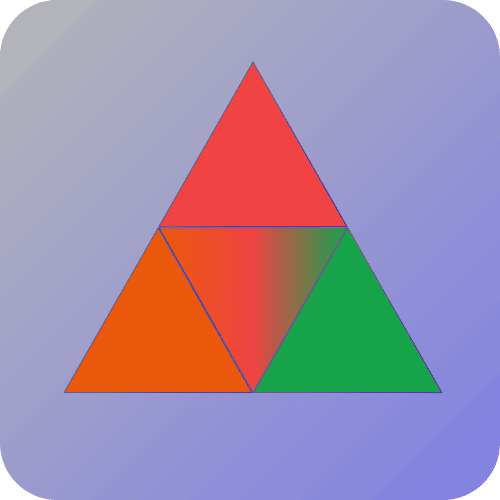
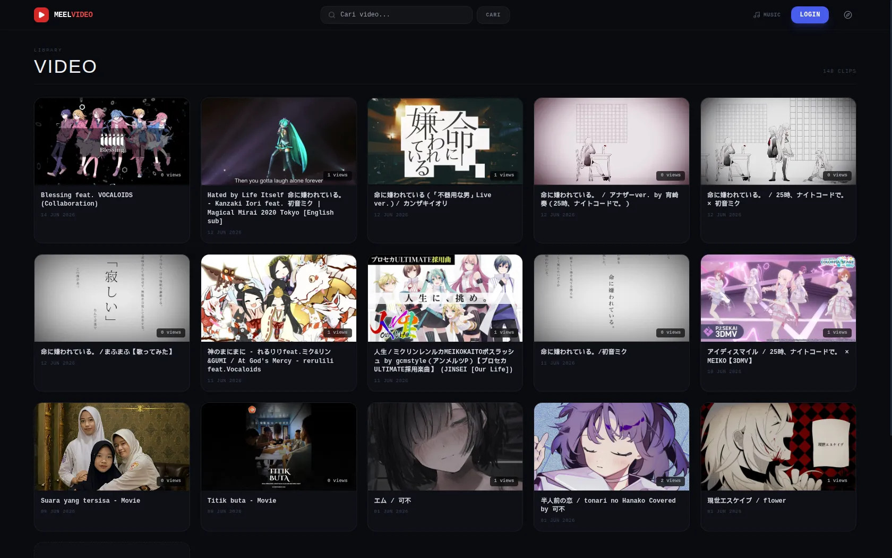
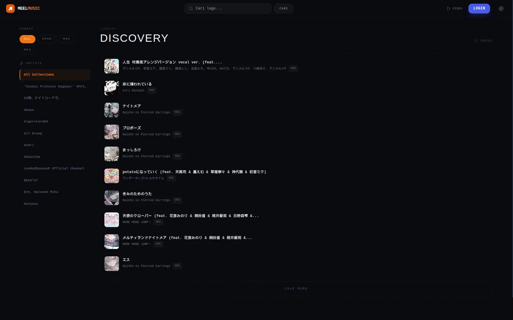

# MEeL-HUB — Media Hub Platform

<div align="center">
  
</div>

**Platform media cloud terpadu untuk streaming video, musik, membaca buku digital, dan penyimpanan file pribadi.**

[](https://www.php.net/)
[](https://www.mysql.com/)
[](https://mariadb.org/)
[](https://tailwindcss.com/)
[](https://ffmpeg.org/)
[](LICENSE)
[](https://github.com/mifada2543/MEeL)
[](https://github.com/mifada2543/MEeL)
---

## 📖 Ikhtisar

**MEeL** adalah platform media hub pribadi berbasis PHP & MySQL yang berjalan di atas Apache (XAMPP/LAMPP). Platform ini menggabungkan modul **Video**, **Music**, **Books**, dan **Cloud Drive** ke dalam antarmuka web gelap bertema monospace yang modern. Sistem ini dilengkapi dengan:

- **Streaming HLS** (HTTP Live Streaming) adaptif
- **Transcoding otomatis** menggunakan FFmpeg
- **Integrasi yt-dlp** untuk download via URL
- **Manajemen file** berbasis peran (RBAC)
- **Mini-game arcade** interaktif (Dino Run & Chess)
- **Sistem keamanan** berlapis (CSRF, IP Banning, Session Management)

---

## ✨ Fitur Utama

### 🎬 Video (Streaming HLS)

| Fitur | Detail |
|-------|--------|
| **Streaming Adaptif** | HLS (`.m3u8` playlist + segment `.ts`) dengan fallback MP4 otomatis |
| **Player Kustom** | Berbasis Plyr.js dengan quality selector, subtitle, PiP, keyboard shortcuts |
| **Gesture Sentuh** | Double-tap kiri (rewind 5s), kanan (forward 5s), tengah (play/pause) |
| **Transisi Mulus** | Video berikutnya dimuat SPA-like tanpa reload, pertahankan fullscreen |
| **Resume Otomatis** | Posisi terakhir disimpan via `localStorage` |
| **Preview Thumbnail** | VTT sprite thumbnail pada seekbar |

### 🎵 Music (Audio Platform)

| Fitur | Detail |
|-------|--------|
| **Visualizer** | WebAudio API spectrum analyzer |
| **Mini Player** | Spotify-style persistent mini player |
| **Streaming** | MP3, FLAC, OGG/Opus, M4A |
| **Playlist** | Buat & kelola playlist kustom |
| **Smart Queue** | Antrean lagu dinamis dengan next/prev |

### 📚 Books (Digital Library)

- Pembaca buku digital (Manga/PDF) terintegrasi di browser
- Upload dengan generate thumbnail otomatis
- Manajemen metadata buku (judul, author, kategori)
- Support ZIP/CBZ untuk manga, PDF untuk e-book

### ☁️ Cloud Drive (Personal Cloud Storage)

| Fitur | Detail |
|-------|--------|
| **Dua Scope** | Public (semua user) & Private (per-user) |
| **Kuota Terbatas** | 20GB per member, unlimited untuk admin |
| **Filter Tipe** | Video, Audio, Dokumen (auto-detect) |
| **Preview In-Browser** | Video, audio, dan gambar bisa dipratinjau |
| **Validasi Magic Bytes** | Cegah file palsu dengan signature detection |

### 🕹️ Arcade (Mini Games)

- **Dino Run** — endless runner ala Chrome Dino dengan karakter Miku & Teto
- **Chess** — permainan catur klasik dengan mode multiplayer online(LAN)
- **Snake** — permainan Snake klasik yang nostalgia

### 🔧 Fungsionalitas Umum

| Fitur | Detail |
|-------|--------|
| **Dashboard Hub** | Statistik kapasitas disk & ringkasan media |
| **Transcoder** | Ekstrak audio dari video (MP3/OGG/M4A) |
| **Download URL** | yt-dlp + FFmpeg untuk download dari YouTube dll |
| **Komentar** | Nested comments pada video & musik |
| **Like/Dislike** | Interaksi sosial pada konten media |
| **Profil User** | Avatar, bio, statistik upload |
| **Mode Sehat 20-20-20** | Notifikasi istirahat mata tiap 20 menit |
| **Activity Logger** | Firewall internal, pelacakan aktivitas, IP banning |
| **Autoloader PSR-4** | Auto-loading class core (`MediaLibrary`, `Uploader`, etc.) tanpa require manual |
| **Migration System** | Database schema versioning + auto-upgrade (FULLTEXT index, performance index) |
| **Base URL Portability** | `base_url()` + `MEEL_BASE_URL` constant — path konsisten di semua subdirektori |
| **FULLTEXT Search** | Search video/music 10-100× lebih cepat via `MATCH AGAINST` (MySQL 5.7+) |
| **Admin Panel** | Dashboard monitoring, manajemen user, queue control |
| **Role Helper** | `get_user_role()` — query role ter-cache, menghilangkan duplikasi di upload files |
| **Redirect Guard** | Validasi URL redirect di playlist_action & delete_comment cegah open redirect |

---
## 📸 Screenshots

### 🎬 Video Library


### 🎵 Music Discovery


> Sisanya menyusul
---

## 🛠️ Tech Stack

| Layer | Teknologi | Keterangan |
|-------|-----------|------------|
| **Backend** | PHP 8.0+ | Core logic & API endpoints |
| **Database** | MySQL 5.7+ / MariaDB 10.2+ | Relational storage & metadata |
| **Web Server** | Apache 2.4+ | `mod_rewrite` engine |
| **Styling** | TailwindCSS (CDN) + Vanilla CSS | Dark-mode monospace theme |
| **Interaktivitas** | HTMX + Vanilla JavaScript | AJAX SPA-like tanpa reload |
| **Media Player** | Plyr.js + HLS.js | HLS video & audio playback |
| **Icons** | Lucide Icons | SVG icon library |
| **Transcoding** | FFmpeg 6.0+ & FFprobe | HLS segmentasi, kompresi, thumbnail |
| **Downloader** | yt-dlp (optional) | Download media dari URL eksternal |
| **Transliterasi** | PHP `intl` (Transliterator) | Pembersihan nama file (Romaji) |
| **Autoloader** | Manual PSR-4-like (`modules/autoload.php`) | Auto-loading 10+ class core |
| **Migration** | PHP-based (`database/migrate.php`) | Schema versioning + FULLTEXT/perf index |

---

## 📁 Struktur Proyek

```
MEeL/
├── admin/                 # Panel Admin (role admin only)
├── anime/                 # Modul Anime (Coming Soon — placeholder page)
│   ├── sidebar.php        # (kosong — menunggu implementasi)
│   ├── watch.php           # Redirect ke index.php
│   └── index.php           # Halaman Coming Soon dengan progress bar
├── arcade/                # Mini Games (Dino Run, Chess)
├── assets/                # Aset statis (CSS, JS, font, gambar)
├── auth/                  # Autentikasi & manajemen sesi
│   ├── config.php         # Konfigurasi database + path terpusat (MEEL_HDD_*)
│   └── config.example.php # Template konfigurasi
├── books/                 # Modul E-Book / Komik
├── controllers/           # API Actions & Event Handler (AJAX/HTMX)
├── database/              # Skema database
│   ├── schema.sql         # File schema standalone (16 tabel)
│   └── migrate.php        # 🔄 Migration system — versioned schema upgrades (FULLTEXT, index)
├── data_drive/            # Cloud Drive storage runtime
├── docs/                  # Dokumentasi proyek
├── drive/                 # Modul Cloud Drive
│   ├── templates/          # Template rendering (file_grid.php)
│   ├── DriveService.php    # OOP: DriveUserContext, DriveStorage, DriveViewRenderer
├── err/                   # Halaman error (denied, maintenance, banned, revoked)
├── modules/               # Core logic & business layer (OOP)
│   ├── helpers.php        # Fungsi bantuan: base_url(), resolve_binary(), time_ago(), dll
│   └── autoload.php       # 🔄 Autoloader PSR-4-like (semua class core auto-load)
├── music/                 # Modul pemutar musik
├── partials/              # Reusable UI components
├── profile/               # Modul profil user
├── temp/                  # Runtime staging transcoding
├── video/                 # Modul pemutar video
├── .htaccess              # Apache rewrite rules
├── index.php              # Homepage Hub / portal modul
├── introduction.php       # Panduan interaktif walkthrough
├── transcode.php          # Entry point transcoding video→audio
├── update.php             # Changelog & update log
└── upload_advanced.php    # Advanced upload via URL (yt-dlp)
```

> 📖 **Dokumentasi lengkap** tersedia di direktori [`docs/`](docs/).

---

## 📋 Persyaratan Sistem

### Minimum Requirements

| Komponen | Versi | Keterangan |
|----------|-------|------------|
| **PHP** | 8.0+ | Versi 8.0+ sangat disarankan |
| **MySQL** | 5.7+ / MariaDB 10.2+ | Skema mendukung encoding `utf8mb4` |
| **Apache** | 2.4+ | Wajib `mod_rewrite` aktif |
| **FFmpeg** | 6.0+ | Untuk HLS segmentasi & kompresi |
| **yt-dlp** | Versi terbaru | Untuk download media via URL |
| **RAM** | 2 GB+ | 4 GB+ direkomendasikan untuk transcoding |
| **Storage** | 10 GB+ | Tergantung ukuran media |

### PHP Extensions Wajib

```ini
extension=mysqli
extension=pdo_mysql
extension=gd
extension=fileinfo
extension=json
extension=mbstring
extension=intl      # Wajib untuk transliterasi karakter Jepang→Romaji
extension=zip       # Untuk ekstraksi file manga (ZIP/CBZ)
```

---

## 🚀 Instalasi Cepat

### 1. Kloning Repositori

```bash
cd /opt/lampp/htdocs
git clone https://github.com/mifada2543/MEeL.git MEeL
```

### 2. Setup Database

```bash
# Buat database
mysql -u root -p -e "CREATE DATABASE IF NOT EXISTS MEeL DEFAULT CHARACTER SET utf8mb4 COLLATE utf8mb4_general_ci;"

# Import skema (jalankan SQL dari README atau file skema)
mysql -u root -p MEeL < schema.sql
```

### 3. Konfigurasi Aplikasi

```bash
cd /opt/lampp/htdocs/MEeL/auth
cp config.example.php config.php
```

Edit `auth/config.php` dan isi kredensial database Anda.

### 4. Setup Direktori Runtime

```bash
cd /opt/lampp/htdocs/MEeL
mkdir -p data_drive/public data_drive/private_admins temp profile/upload
sudo chown -R www-data:www-data data_drive temp profile/upload
sudo chmod -R 775 data_drive temp profile/upload
```

### 5. Aktifkan mod_rewrite Apache

```bash
sudo a2enmod rewrite
sudo systemctl restart apache2
```

> ⚠️ **Default Login:** Username: `Admin` | Password: `Admin#123`

> 📖 **Instalasi detail** → [docs/installation.md](docs/installation.md)

---

## ⚙️ Konfigurasi

### File Konfigurasi Utama

| File | Keperluan |
|------|-----------|
| `auth/config.php` | Database, session, CSRF, **path terpusat (`MEEL_HDD_*`)** |
| `auth/config.example.php` | Template konfigurasi (copy ke config.php) |
| `database/schema.sql` | Skema database standalone |
| `modules/Transcoder.php` | FFmpeg, yt-dlp, CPU threads |
| `modules/Uploader.php` | Upload file, FFmpeg |
| `modules/helpers.php` | HDD check path (dari `MEEL_HDD_BASE`) |
| `modules/System.php` | Queue & rate limit config |

### Konfigurasi Path Terpusat

```php
// auth/config.php — ★ Cukup ubah 1 baris ini
define('MEEL_HDD_BASE', '/media/[user]/MEeL/media');

// Semua modul otomatis mengikuti:
define('MEEL_HDD_VIDEO_UPLOAD', MEEL_HDD_BASE . '/video/upload/');
define('MEEL_HDD_VIDEO_DIR',    MEEL_HDD_VIDEO_UPLOAD . 'video/');
define('MEEL_HDD_THUMB_DIR',    MEEL_HDD_VIDEO_UPLOAD . 'thumbnail/');
define('MEEL_HDD_MUSIC_UPLOAD', MEEL_HDD_BASE . '/music/upload/');
// ... dan seterusnya
```

### Base URL Portability

```php
// auth/config.php — Auto-detected dari __DIR__, bisa dioverride
define('MEEL_BASE_URL', '/MEeL'); // Contoh jika di subdirektori

// Di view/pages:
// Otomatis konsisten, tidak peduli dari mana file di-include
$url = base_url('/assets/css/style.css'); // → /MEeL/assets/css/style.css
```

### Migration System

```bash
# Upgrade database ke versi terbaru (FULLTEXT index, performance index, dll)
/opt/lampp/bin/php database/migrate.php
```

Migration bersifat **idempotent** — aman dijalankan berulang kali. Setiap migrasi hanya dijalankan sekali berdasarkan versi yang tercatat di tabel `db_version`.

> 📖 **Konfigurasi lengkap** → [docs/configuration.md](docs/configuration.md)

---

## 👥 Role-Based Access Control

| Role | Hak Akses |
|------|-----------|
| **Admin** | Kontrol penuh: semua modul, admin panel, upload advanced, transcode, manajemen user, IP banning |
| **Member** | Semua media, komentar, like/dislike, books, Cloud Drive pribadi (quota 20GB) |
| **User** | Semua media, komentar, like/dislike, books (tanpa Cloud Drive) |
| **Guest** | Terbatas: hanya nonton/dengar tanpa interaksi |

---

## 📚 Dokumentasi Lengkap

Dokumentasi proyek tersedia di direktori [`docs/`](docs/):

| Dokumen | Deskripsi |
|---------|-----------|
| [📖 Index](docs/index.md) | Peta dokumentasi |
| [🚀 Instalasi](docs/installation.md) | Panduan instalasi detail |
| [⚙️ Konfigurasi](docs/configuration.md) | Referensi konfigurasi |
| [🏗️ Modul](docs/modules.md) | Arsitektur modul & class diagram |
| [🔌 API](docs/api.md) | Endpoint controllers |
| [🔒 Keamanan](docs/security.md) | Sistem keamanan & RBAC |
| [🌍 Problem Solved](docs/problem-solved.md) | Masalah dunia nyata yang MEeL selesaikan |
| [🔧 Troubleshooting](docs/troubleshooting.md) | Pemecahan masalah umum |
| [👨‍💻 Development](docs/development.md) | Panduan kontribusi |
| [📥 Advanced Upload](docs/upload_issue.md) | Penanganan masalah yt-dlp & queue |

---

## 📄 Lisensi

Proyek ini dilisensikan di bawah **GNU General Public License v3.0 (GPLv3)**.

```
✅ Anda bebas untuk:
   • Menggunakan, menyalin, dan mendistribusikan perangkat lunak ini
   • Memodifikasi dan membuat karya turunan
   • Menggunakannya untuk keperluan komersial
   • Menjalankan untuk keperluan pribadi, pendidikan, atau publik

⚠️ Kewajiban (Copyleft):
   • Anda harus menyertakan lisensi GPLv3 yang sama pada distribusi ulang
   • Anda harus menyertakan kode sumber jika Anda mendistribusikan secara publik
   • Anda harus mencantumkan perubahan yang dibuat
   • Lisensi ini bersifat "viral" — karya turunan harus tetap GPLv3
```

> © 2026 Mifada. Beberapa hak dilindungi. Lihat [LICENSE](LICENSE) untuk detail.
---
## Q&A
### Q: Kenapa belum ada versi docker?

>A: Karena proyek ini mesih dalam tahap <strong>pengembangan</strong> dan <strong>debugging</strong>, jadi docker mesih kurang relevan untuk proyek ini


### Q: Kenapa absolut path?

>A: Lebih mudah dalam mengkonfigurasi jika anda menggunakan media eksternal seperti HDD(mengurangi memori system penuh)


### Q: Ukuran MEeL?

>A: 77MB untuk source codenya, 1-2GB untuk env(ffmpeg, yt-dlp, apache, MariaDB, php, dsb).


### Q: System Requirement?

>A: CPU 2 Core 2GHz cukup, GPU optional karena seluruh process bergantung pada CPU(anda dapat konfigurasi ulang dibagian codec jika ingin menggunakan accelerate GPU untuk transcoding), RAM 2GB cukup namun saran 4GB untuk membantu transcoding, ROM disesuaikan saja, OS ubuntu server, intinya linux dan asal ada env nya itu bisa pakai MEeL.
---

### ⚠️ Pernyataan Penting / Disclaimer

> [!IMPORTANT]
> **Catatan Hukum**: Pembuat (Mifada) tidak bertanggung jawab dan tidak terlibat atas segala jenis berkas media yang diunggah, disimpan, atau disebarluaskan oleh pihak ketiga yang menggunakan atau memodifikasi kode MEeL-HUB ini. Seluruh risiko penggunaan dan kepatuhan hak cipta kembali ke tanggung jawab masing-masing pengguna.

> 🌐 **Domain Status:**
> * **EN:** The public demo domain may occasionally be unavailable because it runs directly on the developer's local device.
> * **ID:** Domain demo publik terkadang tidak berfungsi karena sistem berjalan langsung di perangkat lokal milik developer.

**Kontak:** `mifada2543@gmail.com` · [github.com/mifada2543](https://github.com/mifada2543)

---

<div align="center">
  <strong>MEeL</strong> © 2026 — Mifada<br>
  <sub>Dibuat dengan ❤️ untuk streaming media pribadi</sub>
</div>
