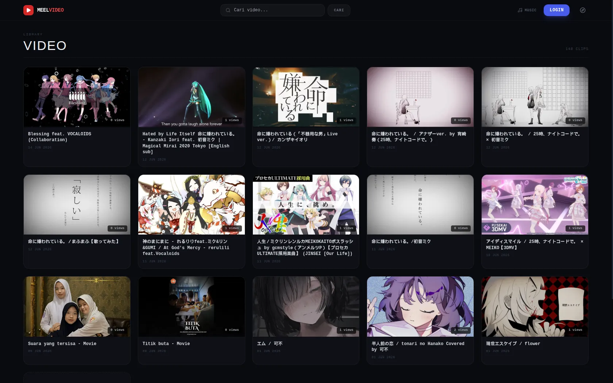
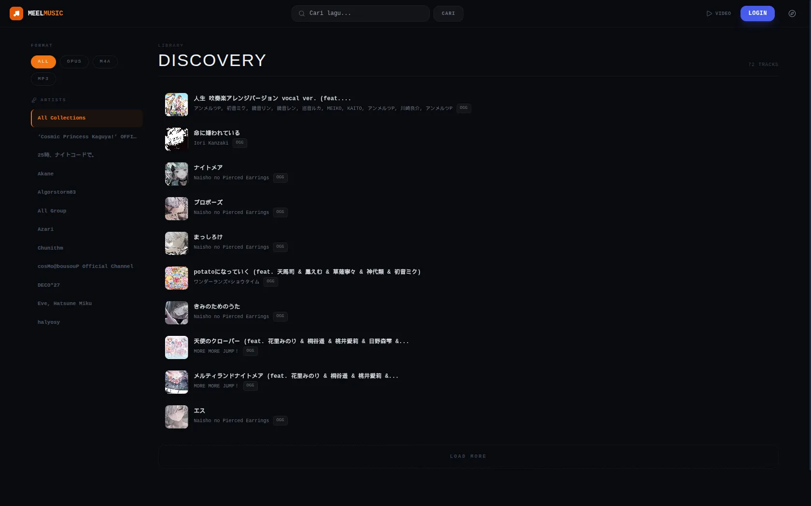

# MEeL-HUB — Media Hub Platform

<div align="center">
  
</div>

**Platform media cloud terpadu untuk streaming video, musik, membaca buku digital, dan penyimpanan file pribadi.**

[](https://www.php.net/)
[](https://www.mysql.com/)
[](https://mariadb.org/)
[](https://tailwindcss.com/)
[](https://ffmpeg.org/)
[](LICENSE)
[](https://github.com/mifada2543/MEeL)
[](https://github.com/mifada2543/MEeL)
[](https://github.com/mifada2543/MEeL)

---

## 📖 Ikhtisar

**MEeL** adalah platform media hub pribadi berbasis PHP & MySQL yang berjalan di atas Apache (XAMPP/LAMPP). Platform ini menggabungkan modul **Video**, **Music**, **Books**, dan **Cloud Drive** ke dalam antarmuka web bertema monospace yang modern (dark & light mode). Sistem ini dilengkapi dengan:

- **Streaming HLS** (HTTP Live Streaming) adaptif
- **Transcoding otomatis** menggunakan FFmpeg
- **Integrasi yt-dlp** untuk download via URL
- **Manajemen file** berbasis peran (RBAC)
- **Mini-game arcade** interaktif (9 game: Miku & Teto Run, Chess, Snake, 2048, Tetris, Breakout, Simon Says, Ludo, MEeL!Mania)
- **Sistem keamanan** berlapis (CSRF, IP Banning, Session Management, Rate Limiting)
- **Audit Trail** aktivitas pengguna dengan admin viewer
- **Dashboard admin** dengan grafik aktivitas 7 hari

---

## ✨ Fitur Utama

### 🎬 Video (Streaming HLS)

| Fitur | Detail |
|-------|--------|
| **Streaming Adaptif** | HLS (`.m3u8` playlist + segment `.ts`) dengan fallback MP4 otomatis |
| **Player Kustom** | Berbasis Plyr.js dengan quality selector, subtitle, PiP, keyboard shortcuts |
| **Gesture Sentuh** | Double-tap kiri (rewind 5s), kanan (forward 5s), tengah (play/pause) |
| **Transisi Mulus** | Video berikutnya dimuat SPA-like tanpa reload, pertahankan fullscreen |
| **Resume Otomatis** | Posisi terakhir disimpan via `localStorage` |
| **Preview Thumbnail** | VTT sprite thumbnail pada seekbar |
| **Auto-Next dengan Countdown** | Overlay YouTube-style countdown 5s + backdrop gelap + tombol batal |
| **Mutual Exclusion Loop/AutoNext** | Auto Next ON → Loop OFF; Loop ON → Auto Next OFF |
| **Ambient Glow** | Real-time canvas sampling → navbar glow + fullscreen bloom |
| **Mini-Player Mode** | Picture-in-picture kustom, navigasi index tanpa reload |
| **Seamless Recovery** | Stuck detector, waiting timeout, auto-reconnect HLS |

### 🎵 Music (Audio Platform)

| Fitur | Detail |
|-------|--------|
| **Visualizer** | WebAudio API spectrum analyzer |
| **Mini Player** | Spotify-style persistent mini player |
| **Streaming** | MP3, FLAC, OGG/Opus, M4A |
| **Playlist** | Buat & kelola playlist kustom |
| **Smart Queue** | Antrean lagu dinamis dengan next/prev |

### 📚 Books (Digital Library)

- Pembaca buku digital (Manga/PDF) terintegrasi di browser
- Upload dengan generate thumbnail otomatis
- Manajemen metadata buku (judul, author, kategori)
- Support ZIP/CBZ untuk manga, PDF untuk e-book

### ☁️ Cloud Drive (Personal Cloud Storage)

| Fitur | Detail |
|-------|--------|
| **Dua Scope** | Public (semua member) & Private (per-member) |
| **Kuota Terbatas** | 20GB per member, unlimited untuk admin |
| **Filter Tipe** | Video, Audio, Dokumen (auto-detect) |
| **Preview In-Browser** | Video, audio, dan gambar bisa dipratinjau |
| **Validasi Magic Bytes** | Cegah file palsu dengan signature detection |

### 🕹️ Arcade (Mini Games)

| Game | Deskripsi |
|------|-----------|
| **Miku & Teto Run** | Endless runner ala Chrome Dino dengan karakter Miku & Teto |
| **Chess** | Catur klasik + multiplayer online (wajib login, pilih warna Putih/Hitam sebelum game dimulai) |
| **Snake** | Permainan Snake klasik yang nostalgia |
| **2048** | Puzzle geser & gabungkan tile hingga 2048 |
| **Tetris** | Game blok legendaris — susun tetromino, bersihkan baris penuh |
| **Breakout** | Hancurkan semua bata dengan bola pantul |
| **Simon Says** | Game memori — ulangi urutan lampu yang makin panjang |
| **Ludo** | Game papan 2–4 pemain — lempar dadu, kejar pion lawan, atau lawan Bot |
| **MEeL!Mania** | Rhythm game 4-lane ala osu!mania (A/S/K/L + touch) — beatmap editor + upload lagu custom |

### 🔧 Fungsionalitas Umum

| Fitur | Detail |
|-------|--------|
| **Dashboard Hub** | Statistik kapasitas disk & ringkasan media |
| **Transcoder** | Ekstrak audio dari video (MP3/OGG/M4A) |
| **Download URL** | yt-dlp + FFmpeg untuk download dari YouTube dll |
| **Komentar** | Nested comments pada video & musik |
| **Like/Dislike** | Interaksi sosial pada konten media |
| **Profil User** | Avatar, bio, statistik upload, **Preference page** (theme toggle) |
| **Light/Dark Mode** | Toggle tema via Profile page — localStorage (guest) + DB sync (login) |
| **Mode Sehat 20-20-20** | Notifikasi istirahat mata tiap 20 menit |
| **Autoloader PSR-4** | Auto-loading class core (`MediaLibrary`, `Uploader`, dll.) tanpa require manual |
| **Migration System v1–v12** | Database schema versioning + auto-upgrade (FULLTEXT, FK, activity_log, UNIQUE KEY, MFA, index komposit, schema sync) |
| **Base URL Portability** | `base_url()` + `MEEL_BASE_URL` constant — path konsisten di semua subdirektori |
| **FULLTEXT Search** | Search video/music/books 10-100× lebih cepat via `MATCH AGAINST` — sanitizer query + pagination (MySQL 5.7+) |
| **Admin Panel** | Dashboard monitoring, manajemen user, queue control, activity log viewer |
| **Role Helper** | `get_user_role()` — query role ter-cache, menghilangkan duplikasi di upload files |
| **Redirect Guard** | Validasi URL redirect cegah open redirect |
| **Archive Guard (CBZ/ZIP)** | `ArchiveGuard` — ekstraksi aman tanpa `extractTo()` langsung: tolak path traversal, null byte, symlink, dan zip bomb (limit entri, ukuran, rasio kompresi, kedalaman) |
| **Upload Atomik & Tokenisasi** | Nama file di-reserve via `fopen('x')` (anti race); `temp_file` memakai token opaque server-side + ownership sesi (post_encode POST+CSRF) |
| **Magic Bytes Terpusat** | `meel_magic_extension_ok()` — validasi signature audio/video/gambar/PDF/arsip di semua jalur upload |
| **Activity Log Integration** | Audit trail login, logout, upload, admin actions — tabel `activity_log` |
| **Admin Activity Log Viewer** | Halaman `admin/activity_log.php` — filter, pagination, cleanup log |
| **API Rate Limiting** | Proteksi endpoint dari abuse (like: 30/menit, comment: 10/menit) |
| **Pagination Metadata** | UI menampilkan info halaman (`total_pages`, `from`, `to`) |
| **Admin Dashboard Charts** | Chart.js 7-Day Activity Chart — views, uploads, active users |
| **PWA Offline** | Service worker dinamis (`sw.js.php` + `SwPrecache`) — precache otomatis per modul via `manifest.php`, installable + offline support |
| **Deployment Health Check** | `tests/check_deploy.php` — verifikasi MEEL_HDD_BASE, folder/subdirektori upload, .htaccess upload, guard symlink data_drive, mod_rewrite PWA |

---

## 📸 Screenshots

### 🎬 Video Library


### 🎵 Music Discovery


---

## 🛠️ Tech Stack

| Layer | Teknologi | Keterangan |
|-------|-----------|------------|
| **Backend** | PHP 8.0+ | Core logic & API endpoints |
| **Database** | MySQL 5.7+ / MariaDB 10.2+ | Relational storage & metadata |
| **Web Server** | Apache 2.4+ | `mod_rewrite` engine |
| **Styling** | TailwindCSS (Self-hosted, Purged) + Vanilla CSS | Dark & Light mode (toggle di Profile) |
| **Interaktivitas** | HTMX + Vanilla JavaScript | AJAX SPA-like tanpa reload |
| **Media Player** | Plyr.js + HLS.js | HLS video & audio playback |
| **Icons** | Lucide Icons | SVG icon library |
| **Transcoding** | FFmpeg 6.0+ & FFprobe | HLS segmentasi, kompresi, thumbnail |
| **Downloader** | yt-dlp (optional) | Download media dari URL eksternal |
| **Transliterasi** | PHP `intl` (Transliterator) | Pembersihan nama file (Romaji) |
| **Autoloader** | Manual PSR-4-like (`modules/autoload.php`) | Auto-loading 10+ class core |
| **Migration** | PHP-based (`database/migrate.php`) | Schema versioning v1–v12 (FULLTEXT, FK, activity_log, UNIQUE KEY, MFA, schema sync) |
| **Rate Limiting** | `modules/auth/RateLimiter.php` | File-based rate limiter (flock safety) |
| **PWA** | `sw.js.php` + `modules/core/SwPrecache.php` | Precache offline otomatis + installable |

---

## 📁 Struktur Proyek

```
MEeL/
├── admin/                 # Panel Admin (role admin only)
│   ├── index.php          # Dashboard with Chart.js activity chart
│   ├── activity_log.php   # Audit trail viewer
│   ├── edit-video.php     # Edit video metadata (khusus admin)
│   └── edit-music.php     # Edit music metadata (khusus admin)
├── arcade/                # Mini Games (9 game: Dino, Chess, Snake, 2048, Tetris, Breakout, Simon Says, Ludo, Rhythm)
├── assets/                # Aset statis (CSS, JS, font, gambar)
├── auth/                  # Autentikasi & manajemen sesi
│   ├── config.php         # Entry point: bootstrap + require settings.php
│   ├── config.example.php # Template entry point
│   ├── settings.php       # Data murni: DB + path terpusat (MEEL_HDD_*)
│   └── settings.example.php # Template data konfigurasi
├── books/                 # Modul E-Book / Komik
├── controllers/           # API Actions & Event Handler (AJAX/HTMX)
│   ├── api/               # WatchController, like, comment, transcode
│   ├── admin/             # admin_actions, admin_data
│   └── profile/           # profile_edit, fun-manage
├── database/              # Skema database
│   ├── schema.sql         # File schema standalone (20 tabel)
│   └── migrate.php        # 🔄 Migration system v1–v12 (FULLTEXT, FK, activity_log, UNIQUE KEY, MFA, schema sync)
├── data_drive/            # Cloud Drive storage runtime
├── docs/                  # Dokumentasi proyek
├── drive/                 # Modul Cloud Drive
│   ├── templates/         # Template rendering (file_grid.php)
│   └── DriveService.php   # OOP: DriveUserContext, DriveStorage, DriveViewRenderer
├── err/                   # Halaman error (denied, maintenance, banned, revoked)
├── modules/               # Core logic & business layer (OOP)
│   ├── autoload.php       # 🔄 Autoloader PSR-4-like (semua class core auto-load)
│   ├── core/              # Semua file core dipindah ke sini
│   │   ├── helpers.php    # Shim backward-compat → helpers/main.php + auth/loader.php
│   │   ├── helpers/       # Utilitas per domain: main, storage, audio, url, metadata, subtitle, upload
│   │   ├── Router.php     # MeelRouter — front controller & tabel rute URL bersih
│   │   ├── base_url.php   # base_url() — path konsisten (MEEL_BASE_URL)
│   │   ├── System.php     # Queue management & monitoring
│   │   ├── Transcoder.php # Facade orchestrator — processDownload / encodeMusic / transcodeVideo
│   │   ├── TranscoderBase.php # Base service transcoder — konstanta + manajemen proses/PID
│   │   ├── Uploader.php   # Upload file & validasi
│   │   ├── GarbageCollector.php # Auto-cleanup temp files + guests + chess rooms + rate limits
│   │   ├── ProgressObserver.php / BrowserProgressObserver.php # Kontrak & presenter progress event
│   │   ├── CommentRenderer.php # Render komentar nested
│   │   ├── activity_logger.php # Logging aktivitas & IP ban check
│   │   ├── japanese.php   # Analisis teks Jepang (MeCab/Romaji)
│   │   ├── japanese_aliases.php # Kamus alias teks Jepang
│   │   ├── SwPrecache.php # Generator precache PWA (sw.js dinamis)
│   │   └── bootstrap.php  # Bootstrap error handling terpusat
│   ├── auth/              # Infrastruktur keamanan terpusat (via loader.php)
│   │   ├── RateLimiter.php # ⚡ File-based API rate limiter
│   │   ├── SsrfGuard.php  # Validasi URL SSRF-safe
│   │   ├── ValidatingProxy.php # Forward proxy SSRF-defense
│   │   └── helpers/       # authz, csrf, session, stream_auth, mfa, user
│   ├── media/             # Media library classes
│   │   ├── MediaLibrary.php   # Query database, search, pagination metadata (+ BookRepository/BookUploader)
│   │   ├── ArchiveGuard.php   # Ekstraksi aman ZIP/CBZ — anti path traversal & zip bomb
│   │   ├── MediaViewer.php    # View tracking, komentar, rekomendasi
│   │   ├── MediaInteraction.php # Like/dislike
│   │   ├── SearchEngine.php   # Mesin pencari FULLTEXT
│   │   ├── PlaylistRepository.php / MediaAdminRepository.php / ProfileRepository.php / AdminActivityRepository.php
│   ├── transcoder/        # Service transcoding (dipanggil facade Transcoder)
│   │   ├── FfmpegUtils.php    # FFmpeg trait – probe, sprite, VTT, getEnvPrefix
│   │   ├── DownloadService.php # Download yt-dlp + finalisasi HLS (finalizeVideo)
│   │   ├── EncodeService.php   # encodeMusic (Opus) + thumbnail
│   │   └── TranscodeService.php# transcodeVideo + ownership file transcode
│   └── exceptions/        # Custom exception classes
│       ├── TranscodeException.php
│       ├── ProcessException.php
│       └── DownloadException.php
├── music/                 # Modul pemutar musik
├── partials/              # Reusable UI components (navbar, footer, head, nav)
├── profile/               # Modul profil user
│   ├── edit-video.php     # Edit video metadata (pemilik non-admin)
│   └── edit-music.php     # Edit music metadata (pemilik non-admin)
├── temp/                  # Runtime staging transcoding + rate limit cache
├── video/                 # Modul pemutar video
├── .htaccess              # Apache rewrite rules
├── sw.js.php              # Service worker dinamis (PWA) — precache otomatis
├── index.php              # Homepage Hub / portal modul
├── introduction.php       # Panduan interaktif walkthrough
├── transcode.php          # Entry point transcoding video→audio
├── update.php             # Changelog & update log
└── upload_advanced.php    # Advanced upload via URL (yt-dlp)
```

> 📖 **Dokumentasi lengkap** tersedia dalam dua bahasa: [🇮🇩 Indonesia](docs/id/index.md) · [🇬🇧 English](docs/en/index.md)

---

## 📋 Persyaratan Sistem

### Minimum Requirements

| Komponen | Versi | Keterangan |
|----------|-------|------------|
| **PHP** | 8.0+ | Versi 8.0+ sangat disarankan |
| **MySQL** | 5.7+ / MariaDB 10.2+ | Skema mendukung encoding `utf8mb4` |
| **Apache** | 2.4+ | Wajib `mod_rewrite` aktif |
| **FFmpeg** | 6.0+ | Untuk HLS segmentasi & kompresi |
| **yt-dlp** | Versi terbaru | Untuk download media via URL |
| **RAM** | 2 GB+ | 4 GB+ direkomendasikan untuk transcoding |
| **Storage** | 10 GB+ | Tergantung ukuran media |

### PHP Extensions Wajib

```ini
extension=mysqli
extension=pdo_mysql
extension=gd
extension=fileinfo
extension=json
extension=mbstring
extension=intl      # Wajib untuk transliterasi karakter Jepang→Romaji
extension=zip       # Untuk ekstraksi file manga (ZIP/CBZ)
```

---

## 🚀 Instalasi Cepat

> ⚡ **Instalasi otomatis (disarankan, Ubuntu/Debian):** jalankan `./install.sh`
> untuk menjalankan semua langkah di bawah secara otomatis — setup database +
> import `schema.sql`, buat `auth/settings.php`/`auth/config.php` (patch DB +
> `MEEL_HDD_BASE`), struktur storage lengkap + symlink deploy ke storage
> terpusat (hardening `.htaccess` ikut disalin), aktifkan mod_rewrite, jalankan
> migrasi, lalu verifikasi akhir `tests/check_deploy.php` (**exit code `1` jika
> ada FAIL**):
>
> ```bash
> sudo chmod +x install.sh
> ./install.sh                 # mode interaktif (tanya konfigurasi)
> ./install.sh --yes           # non-interaktif, pakai semua default
> ./install.sh --hdd=/path     # set MEEL_HDD_BASE langsung
> ./install.sh --skip-apt      # lewati instalasi paket sistem (sudah ada)
> ./install.sh --xsendfile     # aktifkan MEEL_USE_XSENDFILE (wajib mod_xsendfile Apache)
> ```
>
> Detail lengkap → [docs/id/installation.md](docs/id/installation.md).

### 1. Kloning Repositori

```bash
cd /opt/lampp/htdocs
git clone https://github.com/mifada2543/MEeL.git MEeL
```

### 2. Setup Database

```bash
# Buat database
mysql -u root -p -e "CREATE DATABASE IF NOT EXISTS MEeL DEFAULT CHARACTER SET utf8mb4 COLLATE utf8mb4_general_ci;"

# Import skema
mysql -u root -p MEeL < database/schema.sql
```

### 3. Konfigurasi Aplikasi

```bash
cd /opt/lampp/htdocs/MEeL/auth
cp settings.example.php settings.php
cp config.example.php config.php
```

Edit `auth/settings.php` dan isi kredensial database Anda (DB + `MEEL_HDD_*`).
File `auth/config.php` adalah entry point yang me-require `settings.php`.

### 4. Setup Direktori Runtime

```bash
cd /opt/lampp/htdocs/MEeL
mkdir -p data_drive/public data_drive/private_admins temp profile/upload \
         music/upload/file music/upload/thumbnail \
         books/upload/manga books/upload/pdf books/upload/thumbnail
sudo chown -R www-data:www-data data_drive temp profile/upload music/upload books/upload
sudo chmod -R 775 data_drive temp profile/upload music/upload books/upload
```

> ⚠️ **JANGAN commit symlink di dalam `data_drive/`.** `data_drive/public` dan
> `data_drive/private_admins` adalah **folder nyata** yang ter-track di repo
> (placeholder `.gitkeep` + `.htaccess` deny). Isinya (file upload user) otomatis
> di-ignore oleh `.gitignore`. Untuk storage Drive di luar repo, set `MEEL_HDD_DRIVE`
> di `auth/settings.php` — modul Drive otomatis mengikuti (fallback ke `data_drive/`
> bila konstanta tidak ada). Symlink manual ke path absolut development
> (`/media/<username>/...`) mem-bocorkan username OS lewat repo publik dan
> membuat modul Drive crash (`RuntimeException: Folder penyimpanan gagal dibuat`)
> di mesin orang lain.

> 💡 **`install.sh` melakukannya otomatis:** struktur storage lengkap (termasuk
> subdirektori `music/upload/{file,thumbnail}` & `books/upload/{manga,pdf,thumbnail}` —
> modul music/books **tidak** membuatnya sendiri), symlink deploy
> `{video,music,books}/upload` + `data_drive/public` → `MEEL_HDD_BASE`, dengan
> `.htaccess` hardening ikut disalin ke target. Subdirektori yang hilang membuat
> upload pertama gagal — cek via `tests/check_deploy.php`.

### 5. Aktifkan mod_rewrite Apache

```bash
sudo a2enmod rewrite
sudo systemctl restart apache2
```

### 6. Jalankan Migration Database

```bash
/opt/lampp/bin/php database/migrate.php
```

### 7. Verifikasi Deployment

```bash
php tests/check_deploy.php        # exit 0 = sehat, 1 = ada FAIL
```

Memverifikasi `MEEL_HDD_BASE`, folder upload + subdirektori non-auto-create
(`music/upload/{file,thumbnail}`, `books/upload/{pdf,thumbnail}`), hardening
`.htaccess`, guard symlink `data_drive/`, dan mod_rewrite PWA.

> ⚠️ **Default Login:** Username: `Admin` | Password: `Admin#123`

> 📖 **Instalasi detail** → [docs/id/installation.md](docs/id/installation.md) | [English](docs/en/installation.md)

---

## ⚙️ Konfigurasi

### File Konfigurasi Utama

| File | Keperluan |
|------|-----------|
| `auth/config.php` | Entry point: bootstrap, session, CSRF, headers (me-require settings.php) |
| `auth/settings.php` | **Data murni**: DB credentials + path terpusat (`MEEL_HDD_*`) |
| `auth/config.example.php` | Template entry point (copy ke config.php) |
| `auth/settings.example.php` | Template data konfigurasi (copy ke settings.php) |
| `database/schema.sql` | Skema database standalone |
| `modules/core/Transcoder.php` | **Facade** — mendelegasikan ke service di `modules/transcoder/` |
| `modules/core/TranscoderBase.php` | Base class service — konstanta (`FFMPEG_THREADS`, `HLS_SEGMENT_DURATION`, dll.) + proses/PID |
| `modules/transcoder/{DownloadService,EncodeService,TranscodeService}.php` | Implementasi download URL, encode music, transcode video |
| `modules/media/ArchiveGuard.php` | Ekstraksi aman ZIP/CBZ — limit anti zip-bomb (`MAX_ARCHIVE_*`) |
| `modules/core/helpers/upload.php` | Helper upload terpusat — magic bytes, alokasi nama atomik, webp, encode opus, insert music |
| `modules/core/Uploader.php` | Upload file, FFmpeg |
| `modules/core/helpers.php` | HDD check path (dari `MEEL_HDD_BASE`) |
| `modules/core/Router.php` | Front controller — tabel rute URL bersih |
| `modules/core/System.php` | Queue & rate limit config |
| `modules/auth/RateLimiter.php` | API rate limiter — per-endpoint limits |

### Konfigurasi Path Terpusat

```php
// auth/settings.php — ★ Cukup ubah 1 baris ini
define('MEEL_HDD_BASE', '/media/CHANGE_ME/MEeL/media');

// Semua modul otomatis mengikuti:
define('MEEL_HDD_VIDEO_UPLOAD', MEEL_HDD_BASE . '/video/upload/');
define('MEEL_HDD_MUSIC_UPLOAD', MEEL_HDD_BASE . '/music/upload/');
define('MEEL_HDD_BOOKS_UPLOAD', MEEL_HDD_BASE . '/books/upload/');
define('MEEL_HDD_DRIVE',        MEEL_HDD_BASE . '/drive/');
```

> ⚠️ **Catatan Migrasi (audit keamanan):** Sejak `auth/settings.php` tidak lagi di-track
> di repositori (di-ignore agar kredensial tidak ter-commit), **developer lama harus
> verifikasi ulang nilai `MEEL_HDD_BASE`** di file `settings.php` lokal mereka setelah
> `git pull`. Nilai default sekarang placeholder `CHANGE_ME` — pastikan path storage
> Anda masih benar, atau media tidak akan ditemukan.

### Base URL Portability

```php
// auth/config.php — Auto-detected dari __DIR__, bisa dioverride
define('MEEL_BASE_URL', '/MEeL'); // Contoh jika di subdirektori

// Di view/pages:
// Otomatis konsisten, tidak peduli dari mana file di-include
$url = base_url('/assets/css/style.css'); // → /MEeL/assets/css/style.css
```

### Migration System

```bash
# Upgrade database ke versi terbaru (v1–v12)
/opt/lampp/bin/php database/migrate.php
```

**Riwayat Migration:**
| Versi | Perubahan |
|-------|-----------|
| **v1** | FULLTEXT index untuk search video, music, books |
| **v2** | Performance index (upload_date) untuk sorting |
| **v3** | Sinkronisasi struktural |
| **v4** | Foreign key constraints (upload_queue, drive_files → users) |
| **v5** | title VARCHAR → TEXT |
| **v6** | activity_log table untuk audit trail |
| **v7** | UNIQUE INDEX on users.username |
| **v8** | role→varchar(20), hapus duplicate UNIQUE KEY, sync default values |
| **v9** | Kolom MFA (`mfa_secret`, `mfa_backup_codes`, `mfa_enabled`) di tabel users |
| **v10** | Index komposit comments `(video_id, created_at)` & `(music_id, created_at)` |
| **v11** | Unique key `interactions` dipecah: `(user_id, video_id)` & `(user_id, music_id)` |
| **v12** | Ikat identitas user ke room catur (`white_user_id`, `black_user_id`) — cegah akses ilegal via `room_code` |

> 💡 **Catatan modul Rhythm (MEeL!Mania):** tabel `arcade_song` & `arcade_score`
> dikelola lewat `arcade/rhythm/migration.sql` — **terpisah** dari migration system
> utama (v1–v12). Import manual sekali: `mysql MEeL < arcade/rhythm/migration.sql`
> (atau jalankan query CREATE TABLE dari file tersebut).

Migration bersifat **idempotent** — aman dijalankan berulang kali.

### Test Results

| Test | Total | Pass | Warn | Fail | Score |
|------|-------|------|------|------|-------|
| **PHPUnit Unit Tests** | 288 | 288 | 0 | **0** | **✅ 100%** |
| **PHPUnit Integration Tests** | 81 | 81 | 0 | **0** | **✅ 100%** |
| **Functional Test** | 55 | 53 pass, 2 warn | 0 | **0** | **✅ 98/100** |
| **Security Test** | 152 | 149 pass, 3 warn | 0 | **0** | **✅ 99/100** |
| **PHP Syntax** | 207 files | 207 | 0 | **0** | **✅ ALL PASS** |

> Security test: 3 warning non-kritis (review query mentah MediaViewer, cek MIME
> profile_edit, dan shell exec System.php) — bukan kegagalan; skor **99/100**.
> Warning validasi filename `download_transcode` sudah **diresolusi** dengan
> allowlist regex + ownership sesi (`ownsTranscodeFile()`).
> Verifikasi storage & deployment: `php tests/check_deploy.php`

> **Status:** ✅ Production-ready — 0 critical, 0 high, 0 medium, 0 low issues.

> 📖 **Panduan Testing** → [🇮🇩 docs/id/test.md](docs/id/test.md) · [🇬🇧 docs/en/test.md](docs/en/test.md)

> 📖 **Konfigurasi lengkap** → [docs/id/configuration.md](docs/id/configuration.md) | [English](docs/en/configuration.md)

---

## 👥 Role-Based Access Control

| Role | Hak Akses |
|------|-----------|
| **Admin** | Kontrol penuh: semua modul, admin panel, upload advanced, transcode, manajemen user, IP banning, activity log viewer |
| **Member** | Semua media, komentar, like/dislike, books, Cloud Drive pribadi (quota 20GB) |
| **User** | Semua media, komentar, like/dislike, books (tanpa Cloud Drive) |
| **Guest** | Terbatas: nonton/dengar tanpa interaksi, profil default, **theme toggle via Preference** |

---

## 📚 Dokumentasi Lengkap

Dokumentasi proyek tersedia dalam dua bahasa:

**🇮🇩 Bahasa Indonesia:** [`docs/id/`](docs/id/index.md)
**🇬🇧 English:** [`docs/en/`](docs/en/index.md)

| Dokumen | 🇮🇩 ID | 🇬🇧 EN |
|---------|:-----:|:-----:|
| 📖 Index Dokumentasi | [🇮🇩](docs/id/index.md) | [🇬🇧](docs/en/index.md) |
| 🚀 Instalasi | [🇮🇩](docs/id/installation.md) | [🇬🇧](docs/en/installation.md) |
| ⚙️ Konfigurasi | [🇮🇩](docs/id/configuration.md) | [🇬🇧](docs/en/configuration.md) |
| 🏗️ Modul & Arsitektur | [🇮🇩](docs/id/modules.md) | [🇬🇧](docs/en/modules.md) |
| 🔌 API & Controller | [🇮🇩](docs/id/api.md) | [🇬🇧](docs/en/api.md) |
| 🔒 Keamanan | [🇮🇩](docs/id/security.md) | [🇬🇧](docs/en/security.md) |
| 🌍 Problem Solved | [🇮🇩](docs/id/problem-solved.md) | [🇬🇧](docs/en/problem-solved.md) |
| 🔧 Troubleshooting | [🇮🇩](docs/id/troubleshooting.md) | [🇬🇧](docs/en/troubleshooting.md) |
| 👨‍💻 Development | [🇮🇩](docs/id/development.md) | [🇬🇧](docs/en/development.md) |
| 📥 Advanced Upload | [🇮🇩](docs/id/upload_issue.md) | [🇬🇧](docs/en/upload_issue.md) |
| 📋 Analisis Proyek | [🇮🇩](docs/id/deskripsi.md) | [🇬🇧](docs/en/analysis.md) |
| 🧪 Testing Guide | [🇮🇩](docs/id/test.md) | [🇬🇧](docs/en/test.md) |
| 📱 PWA & Offline | [🇮🇩](docs/id/pwa.md) | [🇬🇧](docs/en/pwa.md) |

---

## 📄 Lisensi

Proyek ini dilisensikan di bawah **GNU General Public License v3.0 (GPLv3)**.

```
✅ Anda bebas untuk:
   • Menggunakan, menyalin, dan mendistribusikan perangkat lunak ini
   • Memodifikasi dan membuat karya turunan
   • Menggunakannya untuk keperluan komersial
   • Menjalankan untuk keperluan pribadi, pendidikan, atau publik

⚠️ Kewajiban (Copyleft):
   • Anda harus menyertakan lisensi GPLv3 yang sama pada distribusi ulang
   • Anda harus menyertakan kode sumber jika Anda mendistribusikan secara publik
   • Anda harus mencantumkan perubahan yang dibuat
   • Lisensi ini bersifat "viral" — karya turunan harus tetap GPLv3
```

> © 2026 Mifada. Beberapa hak dilindungi. Lihat [LICENSE](LICENSE) untuk detail.

---

## Q&A

### Q: Kenapa belum ada versi docker?

> A: Karena proyek ini masih dalam tahap **pengembangan** dan **debugging**, jadi docker masih kurang relevan untuk proyek ini.

### Q: Kenapa absolut path?

> A: Lebih mudah dalam mengkonfigurasi jika anda menggunakan media eksternal seperti HDD (mengurangi memori system penuh).

### Q: Ukuran MEeL?

> A: 47,3MB untuk source codenya, 1-2GB untuk env (ffmpeg, yt-dlp, apache, MariaDB, php, dsb).

### Q: System Requirement?

> A: CPU 2 Core 2GHz cukup, GPU optional karena seluruh process bergantung pada CPU (anda dapat konfigurasi ulang dibagian codec jika ingin menggunakan accelerate GPU untuk transcoding), RAM 2GB cukup namun saran 4GB untuk membantu transcoding, ROM disesuaikan saja, OS ubuntu server, intinya linux dan asal ada env nya itu bisa pakai MEeL.

---

### ⚠️ Pernyataan Penting / Disclaimer

> [!IMPORTANT]
> **Catatan Hukum**: Pembuat (Mifada) tidak bertanggung jawab dan tidak terlibat atas segala jenis berkas media yang diunggah, disimpan, atau disebarluaskan oleh pihak ketiga yang menggunakan atau memodifikasi kode MEeL-HUB ini. Seluruh risiko penggunaan dan kepatuhan hak cipta kembali ke tanggung jawab masing-masing pengguna.

> 🌐 **Domain Status:**
> * **EN:** The public demo domain may occasionally be unavailable because it runs directly on the developer's local device.
> * **ID:** Domain demo publik terkadang tidak berfungsi karena sistem berjalan langsung di perangkat lokal milik developer.

**Kontak:** `mifada2543@gmail.com` · [github.com/mifada2543](https://github.com/mifada2543)

---

<div align="center">
  <strong>MEeL</strong> © 2026 — Mifada<br>
  <sub>Dibuat dengan ❤️ untuk streaming media pribadi</sub>
</div>
